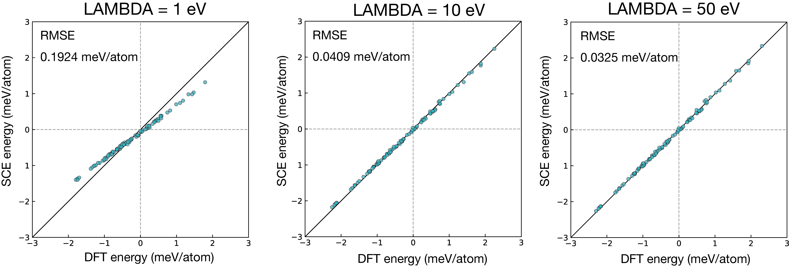

# Penalty term dependence

In VASP calculations, we must choose a sufficiently large penalty term (parameter `LAMBDA`).
The following results are for an fcc Ni 2×2×2 cubic supercell (containing 32 atoms).
The SCE model was fitted to torques and evaluated against energy predictions for 100 spin configurations generated with different values of `LAMBDA`.

The spin configurations were sampled from the mean-field Heisenberg distribution at a reduced temperature
``\tau = T / T_C^{\mathrm{MFA}} = 0.1``, where ``T_C^{\mathrm{MFA}}`` is the transition temperature in the mean-field approximation:

```math
P_i(\hat{\boldsymbol{e}}_i) = \frac{3m/\tau}{4\pi \sinh(3m/\tau)}
\exp\!\left(\frac{3\,\boldsymbol{m} \cdot \hat{\boldsymbol{e}}_i}{\tau}\right),
```
where ``\boldsymbol{m} = m \hat{\boldsymbol{e}}`` is the global normalized magnetization vector pointing along ``\hat{\boldsymbol{e}}``.

The sampling script is located at `tools/sampling_mfa.jl`:

```
julia sampling_mfa.jl INCAR tau -s 0.1 -e 0.1 -w 1 -n 100
```

A small `LAMBDA` leads to noticeable deviation between predicted and reference energies.
We therefore recommend using a sufficiently large value.
Note that starting directly with a large `LAMBDA` often causes SCF convergence difficulties;
it is advisable to use restart calculations, gradually increasing `LAMBDA` from a small initial value.



The calculations were performed with VASP 6.4.1.
The base `INCAR` file used is shown below.

```
NCORE = 4
ENCUT = 350.0
PREC = accurate
NBANDS = 400
GGA = PE

EDIFF = 3.2E-6
NELM = 200
NELMDL = -5
NELMIN=  7

IMIX = 4
AMIX = 0.1
BMIX = 1.0 
AMIX_MAG  = 0.1
BMIX_MAG  = 1.0

NSW = 0
IBRION = -1
POTIM = 0.10

LMAXMIX = 4
LREAL = .FALSE.
LWAVE = .FALSE.
LCHARG = .TRUE.

LNONCOLLINEAR = .TRUE.
I_CONSTRAINED_M = 4
RWIGS = 1.242
LAMBDA = 1
M_CONSTR = 0 0 1.20  0 0 1.20  0 0 1.20  0 0 1.20  0 0 1.20  0 0 1.20  0 0 1.20  0 0 1.20  0 0 1.20  0 0 1.20  0 0 1.20  0 0 1.20  0 0 1.20  0 0 1.20  0 0 1.20  0 0 1.20  0 0 1.20  0 0 1.20  0 0 1.20  0 0 1.20  0 0 1.20  0 0 1.20  0 0 1.20  0 0 1.20  0 0 1.20  0 0 1.20  0 0 1.20  0 0 1.20  0 0 1.20  0 0 1.20  0 0 1.20  0 0 1.20
MAGMOM = 0 0 1.20  0 0 1.20  0 0 1.20  0 0 1.20  0 0 1.20  0 0 1.20  0 0 1.20  0 0 1.20  0 0 1.20  0 0 1.20  0 0 1.20  0 0 1.20  0 0 1.20  0 0 1.20  0 0 1.20  0 0 1.20  0 0 1.20  0 0 1.20  0 0 1.20  0 0 1.20  0 0 1.20  0 0 1.20  0 0 1.20  0 0 1.20  0 0 1.20  0 0 1.20  0 0 1.20  0 0 1.20  0 0 1.20  0 0 1.20  0 0 1.20  0 0 1.20
ISYM = 0
```

The `POSCAR` used is:

```
Ni
3.5158
2 0 0
0 2 0
0 0 2
   Ni
   32
Direct
     0.000000000         0.000000000         0.000000000
     0.000000000         0.250000000         0.250000000
     0.250000000         0.000000000         0.250000000
     0.250000000         0.250000000         0.000000000
     0.000000000         0.000000000         0.500000000
     0.500000000         0.000000000         0.000000000
     0.000000000         0.500000000         0.000000000
     0.000000000         0.250000000         0.750000000
     0.500000000         0.250000000         0.250000000
     0.000000000         0.750000000         0.250000000
     0.250000000         0.000000000         0.750000000
     0.750000000         0.000000000         0.250000000
     0.250000000         0.500000000         0.250000000
     0.250000000         0.250000000         0.500000000
     0.750000000         0.250000000         0.000000000
     0.250000000         0.750000000         0.000000000
     0.000000000         0.500000000         0.500000000
     0.500000000         0.000000000         0.500000000
     0.500000000         0.500000000         0.000000000
     0.000000000         0.750000000         0.750000000
     0.500000000         0.250000000         0.750000000
     0.500000000         0.750000000         0.250000000
     0.250000000         0.500000000         0.750000000
     0.750000000         0.000000000         0.750000000
     0.750000000         0.500000000         0.250000000
     0.250000000         0.750000000         0.500000000
     0.750000000         0.250000000         0.500000000
     0.750000000         0.750000000         0.000000000
     0.500000000         0.500000000         0.500000000
     0.500000000         0.750000000         0.750000000
     0.750000000         0.500000000         0.750000000
     0.750000000         0.750000000         0.500000000
```

The `KPOINTS` used is:

```
Ni
0
Gamma
4 4 4
0 0 0
```
