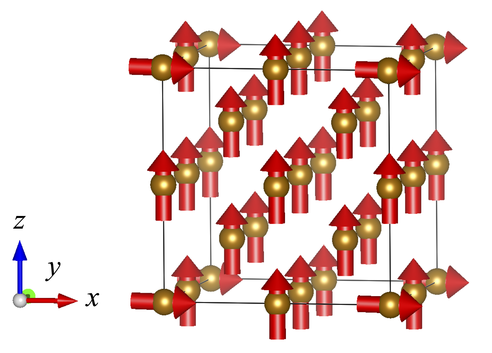
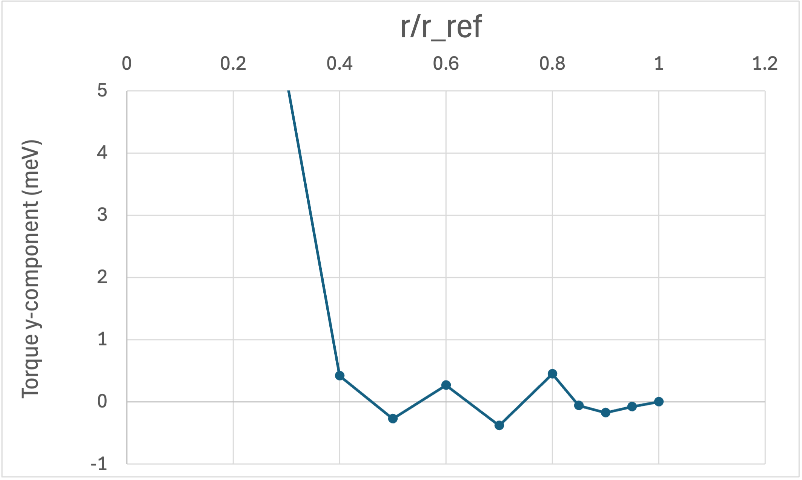
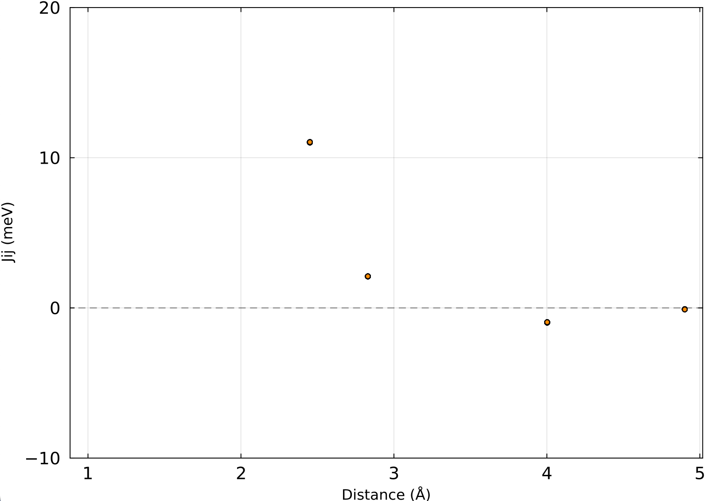

# RWIGS Dependence

In spin-direction-constrained noncollinear calculations by VASP, a constraining field is applied to each atom to enforce the prescribed spin orientation.
The spatial extent of the atomic region over which this constraint acts is controlled by the `RWIGS` parameter.
Here we demonstrate that the extracted spin model parameters are not sensitive to the choice of `RWIGS`, as long as the value is not reduced to an extreme degree.

## Setup

A bcc Fe 2×2×2 cubic supercell containing 16 atoms was used.
The system was initialized in a nearly ferromagnetic state: one atom (atom $i_0$) has its magnetic moment $\boldsymbol{m}_{i_0}$ tilted to point along the positive $x$-axis, while all remaining atoms have their moments aligned along the positive $z$-axis.
Only the orientations of the magnetic moments are constrained; their magnitudes are allowed to relax freely.
The magnetic configuration is illustrated in Fig. 1.

```@raw html

```

*Fig. 1: Magnetic configuration of the bcc Fe supercell. One atom is tilted toward the $x$-axis; all others remain along the $z$-axis.*

## Torque Analysis

Let $r_\mathrm{ref}$ denote half the nearest-neighbor distance, which serves as a natural length scale for the atomic sphere radius.
We vary the RWIGS parameter $r$ over the range $r/r_\mathrm{ref} \in (0, 1]$ and monitor the torque acting on the tilted atom $i_0$.

The torque on atom $i$ is defined as

$$\boldsymbol{\tau}_i = \boldsymbol{m}_i \times \boldsymbol{B}_{\mathrm{eff},i},$$

where $\boldsymbol{m}_i$ is the magnetic moment vector of atom $i$ and $\boldsymbol{B}_{\mathrm{eff},i}$ is the effective magnetic field at site $i$.
Since $\boldsymbol{m}_{i_0}$ points along $x$ and $\boldsymbol{B}_{\mathrm{eff},i_0}$ is directed nearly along $z$, the torque $\boldsymbol{\tau}_{i_0}$ is oriented nearly along the negative $y$-axis.
Figure 2 shows the $y$-component of $\boldsymbol{\tau}_{i_0}$ as a function of $r/r_\mathrm{ref}$.
The torque remains nearly constant over a wide range of $r$, confirming that the extracted parameters are insensitive to `RWIGS`.

This result can be understood intuitively as follows.
As $r$ decreases, the integrated magnetic moment $|\boldsymbol{m}_i|$ within the atomic sphere inevitably decreases.
At the same time, the constraining field required to maintain the prescribed moment direction — which is equal in magnitude but opposite in direction to $\boldsymbol{B}_{\mathrm{eff},i_0}$ — increases correspondingly.
These two competing effects largely cancel, leaving the torque $\boldsymbol{\tau}_{i_0} = \boldsymbol{m}_{i_0} \times \boldsymbol{B}_{\mathrm{eff},i_0}$ nearly independent of `RWIGS`.

```@raw html

```

*Fig. 2: $y$-component of the torque $\boldsymbol{\tau}_{i_0}$ on the tilted atom as a function of $r/r_\mathrm{ref}$.*

## Heisenberg Exchange Parameters

As a further check, we extract the Heisenberg exchange parameters $J_{ij}$ at several values of $r/r_\mathrm{ref}$ and compare them.
The Heisenberg Hamiltonian is defined as

$$\mathcal{H} = -\sum_{i,j} J_{ij}\, \boldsymbol{e}_i \cdot \boldsymbol{e}_j,$$

where $\boldsymbol{e}_i = \boldsymbol{m}_i / |\boldsymbol{m}_i|$ is the unit vector along the magnetic moment of atom $i$, and the sum runs over all ordered pairs $(i, j)$ with double counting.
Figure 3 shows $J_{ij}$ as a function of interatomic distance for $r/r_\mathrm{ref} = 1.0,\ 0.8,\ 0.7,\ 0.5$, plotted using `plot_jij.jl` with the `-i -H` options (corresponding to $-J_{ij}/2$).
The curves overlap almost entirely, confirming that the exchange parameters are robust against the choice of `RWIGS`.

```@raw html

```

*Fig. 3: Heisenberg exchange parameters $J_{ij}$ as a function of interatomic distance for $r/r_\mathrm{ref} = 1.0,\ 0.8,\ 0.7,\ 0.5$. The markers overlap almost entirely in the displayed range, indicating negligible dependence on `RWIGS`.*

## Computational Details

The calculations were performed with VASP 5.4.4.
The base `INCAR` file ($r/r_\mathrm{ref} = 1.0$) used is shown below.

```
NCORE = 4

ICHARG = 1
ISTART = 1

ENCUT = 300.0
PREC = accurate
NBANDS = 200
GGA = PE
GGA_COMPAT = False
LASPH= True

EDIFF = 1.6E-6
NELM = 300

IMIX = 4
AMIX      = 0.02
BMIX      = 0.01
AMIX_MAG  = 0.02
BMIX_MAG  = 0.01

NSW = 0
IBRION = -1
POTIM = 0.10


LREAL = .FALSE.
LWAVE = .TRUE.
LCHARG = .TRUE.


LORBIT = 0

LNONCOLLINEAR = .TRUE.
I_CONSTRAINED_M = 1
RWIGS = 1.22533 1.22533
LAMBDA = 50
M_CONSTR = 2.3 0 0  0 0 2.3  0 0 2.3  0 0 2.3  0 0 2.3  0 0 2.3  0 0 2.3  0 0 2.3  0 0 2.3  0 0 2.3  0 0 2.3  0 0 2.3  0 0 2.3  0 0 2.3  0 0 2.3  0 0 2.3

ISYM = 0
MAGMOM = 2.3 0 0  0 0 2.3  0 0 2.3  0 0 2.3  0 0 2.3  0 0 2.3  0 0 2.3  0 0 2.3  0 0 2.3  0 0 2.3  0 0 2.3  0 0 2.3  0 0 2.3  0 0 2.3  0 0 2.3  0 0 2.3
```

The `POSCAR` used is:

```
bccFe
2.8298
2.00   0.00   0.00
0.00   2.00   0.00
0.00   0.00   2.00
   Fe1 Fe2
   1 15
Direct
     0.000000000         0.000000000         0.000000000
     0.250000000         0.250000000         0.250000000
     0.000000000         0.000000000         0.500000000
     0.500000000         0.000000000         0.000000000
     0.000000000         0.500000000         0.000000000
     0.250000000         0.250000000         0.750000000
     0.750000000         0.250000000         0.250000000
     0.250000000         0.750000000         0.250000000
     0.000000000         0.500000000         0.500000000
     0.500000000         0.000000000         0.500000000
     0.500000000         0.500000000         0.000000000
     0.250000000         0.750000000         0.750000000
     0.750000000         0.250000000         0.750000000
     0.750000000         0.750000000         0.250000000
     0.500000000         0.500000000         0.500000000
     0.750000000         0.750000000         0.750000000
```

The `KPOINTS` used is:

```
bccFe
0
Gamma
3 3 3
0 0 0
```
